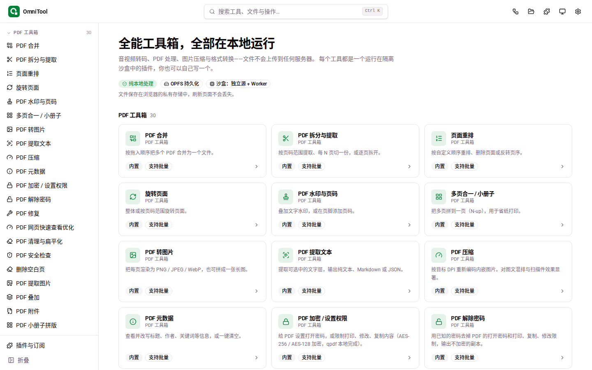
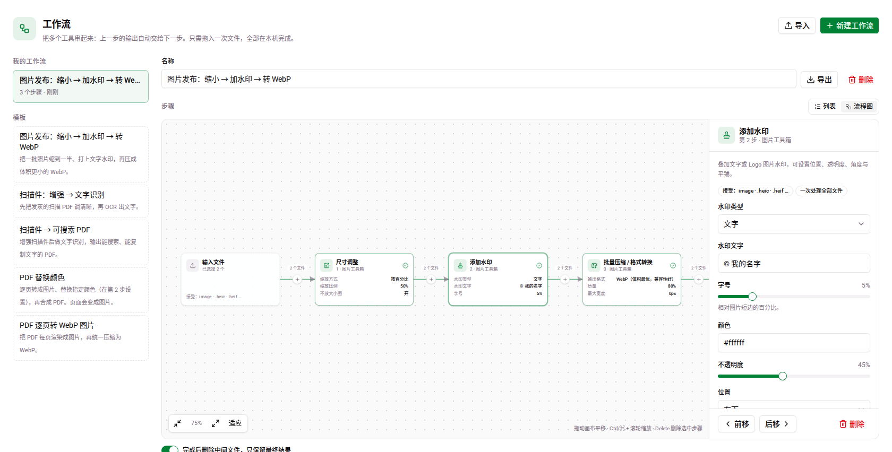

<div align="center">


# OmniTool

**端侧优先的高性能多媒体与文件处理工作台**

无需上传服务器，所有计算（PDF 编排、图像渲染、音视频转码、离线 AI 推理）均在浏览器内部通过 WebAssembly、Web Workers 与本地神经网络引擎执行。

[](LICENSE)
[](CHANGELOG.md)
[](https://vuejs.org/)
[](https://www.typescriptlang.org/)
[](CONTRIBUTING.md)

[功能特性](#核心特性) · [工具矩阵](#内置工具矩阵) · [快速开始](#快速开始) · [插件开发](#插件化体系) · [安全沙盒](#端侧安全沙盒模型) · [开发贡献](CONTRIBUTING.md) · [更新日志](CHANGELOG.md)

</div>

<br />



## 核心特性

- **端侧绝对隐私（Local-First）**：运算过程完全发生在用户本地环境，无任何服务端数据流转。转码、压缩、OCR 及语音识别均在本机即时完成，中间过程与产物均托管于浏览器源私有文件系统（OPFS），断网亦可全功能离线运行。
- **95 款开箱即用工具**：全面覆盖 PDF 编排、专业图像转换、音视频剪辑转码、结构化数据解析及本地 AI 推理，深度对标 Stirling-PDF、SnapOtter 等开源工具集的核心功能。
- **微内核与无特权插件沙盒**：每个工具均作为无特权插件运行于隔离沙盒内，遵循最小权限原则，对底层能力的每一次调用均需通过宿主仲裁。内置工具与第三方插件享有完全对等的开放接口。
- **自动化工作流（Pipeline）**：支持将多个离散工具编排为自动化处理流水线，提供自由缩放平移的拓扑画布与轻量列表双重视图，支持节点参数检查与数据流状态监控。
- **零后端静态交付**：所有 WebAssembly 运行时与资产同源托管，无需容器集群或后端计算节点，部署仅需普通静态 Web 服务器。

## 内置工具矩阵

| 业务领域 | 工具数 | 覆盖能力与核心工具 |
| --- | --- | --- |
| **PDF 处理** | 30 款 | 页面重排、无损合并拆分、小册子拼版、栅格化转图、结构清理、元数据擦除、手写签名与印章、真·页面涂黑脱敏（整页栅格化）、文本提取、扫描件对比度增强、表单填写、自动倾斜校正、权限管控与解密（原生 qpdf 驱动）、Web 线性化快速视图优化 |
| **图形图像** | 27 款 | Canvas 与 ImageMagick（Wasm）双引擎自适应调度：支持 HEIC、TIFF、PSD、JXL、RAW 格式无损解析与元数据保留；位图矢量化（Bitmap to SVG）、空域降噪、接缝裁剪（Seam Carving）内容感知缩放、色彩置换与滤镜、图元对比校验、精灵图排版、条形码与二维码多协议矩阵编解码 |
| **音视频工程** | 16 款 | 基于 FFmpeg.wasm 的音视频流控：毫秒级切片截取、多轨分离、重采样降噪、音量包络控制、动图导出（GIF/WebP/APNG）、视频水印烧录、双语字幕抽取与硬字幕压制、动态音频频谱波形渲染 |
| **数据与文本** | 12 款 | JSON / YAML / CSV / XML 双向互转、超大 CSV 流式清洗、Markdown 导出为带目录 PDF 或标准 EPUB 电子书、RFC 822 EML 与 Outlook MSG 邮件解析、矢量字体格式转换与子集化提取、数据图表生成 |
| **归档压缩** | 2 款 | 基于 fflate 与 libarchive-wasm：纯前端流式归档打包（ZIP / TAR / TAR.GZ / GZ）；解压 7z、RAR 及带密码加密 ZIP 归档 |
| **端侧 AI 推理** | 8 款 | 基于 ONNX Runtime Web 的离线神经网络：U²-Net 智能抠图、Swin2SR 图像双倍超分辨率放大、PP-OCRv4 文字识别与双层检索 PDF 导出、Whisper 离线语音转写、LaMa / MI-GAN 画面元素消除、人脸隐私遮蔽与去红眼 |

详细的工具实现指标、可行性分析与浏览器技术边界评估，请参阅 [工具矩阵与可行性分析](docs/design/03-tool-matrix.md)。



## 快速开始

### 一键部署（Vercel）

[](https://vercel.com/new/clone?repository-url=https%3A%2F%2Fgithub.com%2FOkysu%2FOmniTool)

项目内建针对静态边缘分发的 [`vercel.json`](vercel.json)，已预置跨源隔离所需的协议响应头。完成部署后，可在「设置 → 诊断」面板核对「跨源隔离：已启用」状态。

### 本地开发与构建

系统依赖要求：Node.js 24+，pnpm 11+（建议开启 `corepack enable`）。

```bash
# 克隆仓库
git clone https://github.com/Okysu/OmniTool.git
cd OmniTool

# 安装依赖
pnpm install

# 启动本地热重载开发服务器
pnpm dev          # 本地服务地址: http://localhost:5173
```

首次运行 `pnpm dev` 或 `pnpm build` 时，流水线将自动执行 `pnpm vendor`，拉取并校验所需的离线运行时依赖（FFmpeg、ONNX Runtime Web、ImageMagick-Wasm、pdf.js 等，共约 140 MB，默认不入库），并在本地缓存离线中文字体及 Whisper 词表。

```bash
pnpm build        # 生产构建（执行资源完整性校验与严格类型审查），输出至 dist/
pnpm preview      # 预览生产构建产物
pnpm test         # 运行 Vitest 单元测试
pnpm test:e2e     # 运行 Playwright 端到端系统回归测试
```

### 私有化 Nginx 静态部署

构建产物 `dist/` 为纯静态资源。由于多线程 WebAssembly 与 `SharedArrayBuffer` 依赖浏览器底层跨源隔离策略，Web 服务器**必须显式配置以下响应标头**，否则系统将自动回退至单线程降级模式：

```nginx
server {
    listen 80;
    server_name omnitool.local;

    root /path/to/OmniTool/dist;
    index index.html;

    # 启用浏览器跨源隔离（必须）
    add_header Cross-Origin-Opener-Policy same-origin always;
    add_header Cross-Origin-Embedder-Policy credentialless always;

    location / {
        try_files $uri $uri/ /index.html;
    }
}
```

## 插件化体系

OmniTool 的所有工具逻辑均基于开放插件规范实现。单个 JavaScript 文件即可定义一套完整的生产级工具，无需预先搭建打包工程：

```javascript
definePlugin({
  id: 'com.example.word-counter',
  name: '字数统计器',
  version: '1.0.0',
  capabilities: ['fs'],
  tools: [
    {
      id: 'count',
      name: '统计字数',
      category: 'document',
      input: 'both', // 支持文件拖拽与纯文本直通
      async run(ctx) {
        const text = await ctx.host.fs.readText(ctx.inputs[0].id)
        const charCount = [...text.replace(/\s/g, '')].length
        return {
          outputs: [],
          summary: `有效字符数（不含空白）：${charCount}`,
        }
      },
    },
  ],
})
```

- **交互式演练场**：访问应用内「插件教程」（`/#/learn`），在真实沙盒环境中边学边调，所见即所得。
- **内置 Monaco 编辑器**：在「插件与订阅 → 创建新插件」中享受全套类型补全与静态清单审查，按 `Ctrl/Cmd + S` 即可实现热挂载。
- **轻量分发**：只需将单一 JS 脚本部署到任意静态服务器或 GitHub Pages，终端用户录入 URL 即可订阅。
- **面向 Agent 开发**：根目录提供机器友好的知识库文件 `/llms-full.txt`，可直接作为大型语言模型生成标准插件的上下文指引。

接口开发技术手册见 [Plugin API 手册](docs/design/02-plugin-api.md)，TypeScript 类型定义见 [`sdk/omnitool-plugin.d.ts`](sdk/omnitool-plugin.d.ts)。

## 端侧安全沙盒模型

为避免非受信第三方插件越权访问用户敏感数据或设备资源，OmniTool 建立了四重纵深防御机制：

1. **无特权执行沙盒**：插件逻辑被限制在不透明来源（Opaque-Origin）iframe 挂载的独立沙盒 Worker 中运行，完全切断直接访问主页面 DOM、Cookie、LocalStorage 及宿主 IndexedDB 的路径。
2. **底层网络隔离**：沙盒环境配置有极严格的 CSP 策略（`default-src 'none'; connect-src 'none'`），切断一切隐式外联渠道。
3. **能力显式仲裁**：插件通过 `host.*` 调用的每一项底层能力均经过宿主微内核的鉴权审查，清单外未声明的能力一律拒绝执行。
4. **受限文件可见范围**：插件仅能访问当前任务指派的输入流及其自身显式输出的文件流，杜绝全盘扫描宿主私有文件系统的可能。

| 能力标识 | 权限边界与安全定义 |
| --- | --- |
| `fs` | 仅限于当前管道上下文的文件流受控读写 |
| `ui` / `image` | 交互状态通知，以及主线程高性能图像编解码管道代理 |
| `kv` | 插件专属的 AES-GCM 本地加密隔离存储 |
| `ffmpeg` | 宿主全局管控的多线程 WebAssembly 音视频转码管道 |
| `onnx` | 端侧神经网络推理加速；权重文件首次下载需经用户显式确认并校验 SHA-256 |
| `secret` | 凭据密态托管：插件仅可按别名发起受控代理调用，**无法读取凭据明文** |
| `net` | 高风险权限：受宿主代理且绝不附加浏览器凭据的外联请求，每次触发均有明确审计记录 |

插件 UI 使用声明式 JSON 结构描述，由宿主负责合规清洗与统一渲染，严禁在主界面执行非受信 HTML 标记。系统威胁模型与安全边界详见 [架构设计白皮书](docs/design/01-architecture.md)。

## 运行环境与浏览器支持

开发与自动化测试基准面向 **Chromium 内核**（Chrome 110+、Edge 等最新稳定版本）。
系统重度依赖源私有文件系统（OPFS）、`OffscreenCanvas`、多线程 WebAssembly 及跨源隔离标头。在缺少上述特性的环境中，系统将自动降级至单线程运算与内存虚拟文件系统模式。

## 文档索引

- [文档总览索引](docs/README.md)
- [Plugin API 规范参考](docs/design/02-plugin-api.md) · [系统架构与安全模型](docs/design/01-architecture.md) · [工具设计矩阵](docs/design/03-tool-matrix.md)
- [迭代纪要与质量验证报告](docs/README.md#迭代记录)

## 开源协议与声明

OmniTool 主体代码基于 [MIT 许可证](LICENSE) 发布。
构建产物中所包含的 FFmpeg WebAssembly 运行核心遵循 GPL-2.0-or-later 协议，其他第三方依赖遵循各自的开源协议。完整合规声明请参阅 [第三方许可声明](THIRD_PARTY_NOTICES.md)。